## NYC Payroll Data Pipeline

A Data Engineering project demonstrating the construction of a data pipeline using Microsoft Azure tools.

### Step 1: Prepare the Data Infrastructure

**Result**:

DataLakeGen2 that shows files are uploaded:

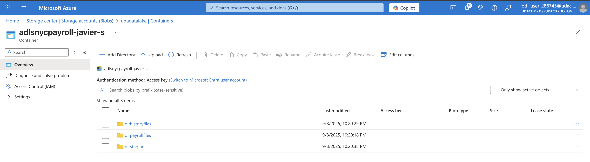

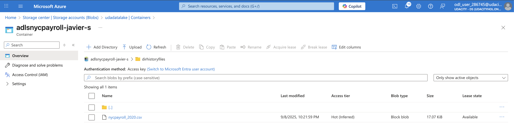

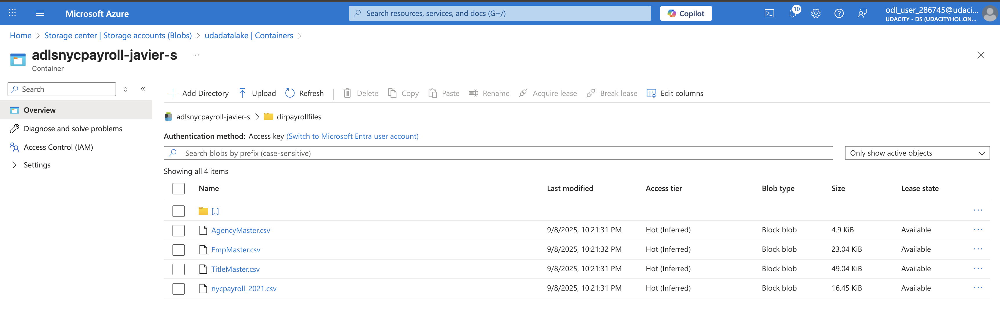

 5 tables created in SQL db:

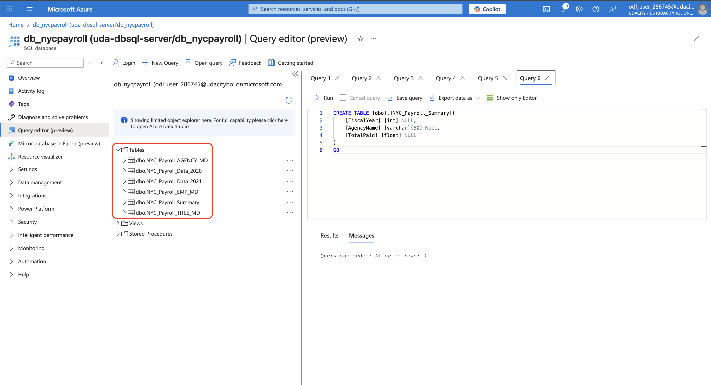

External table created in Synapse:

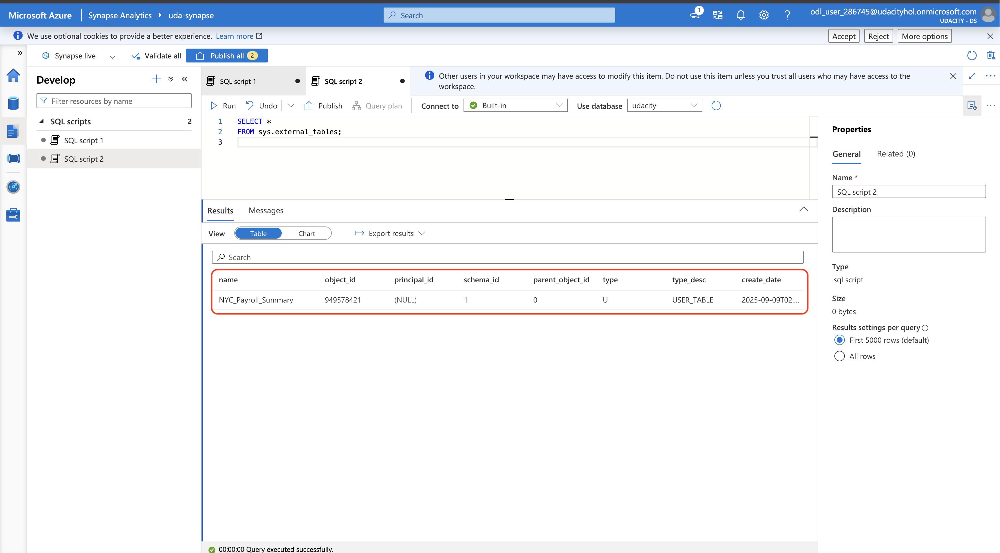

### Step 2: Create Linked Services

Linked Services page after successful creation:

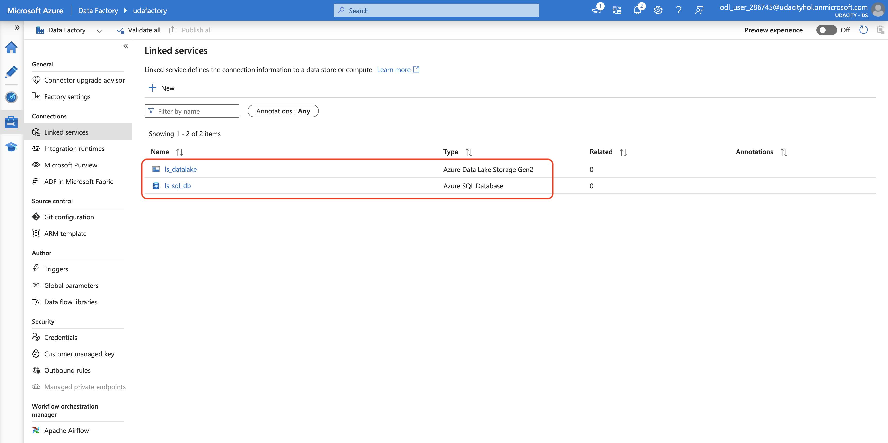

### Step 3: Create Datasets in Azure Data Factory

Created Datasets for files in Data Lake Gen2:

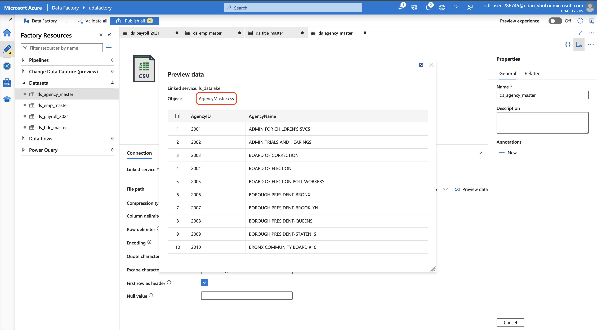

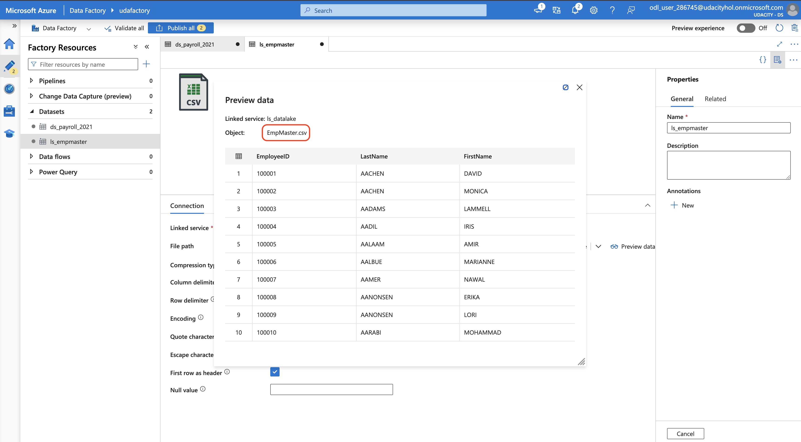

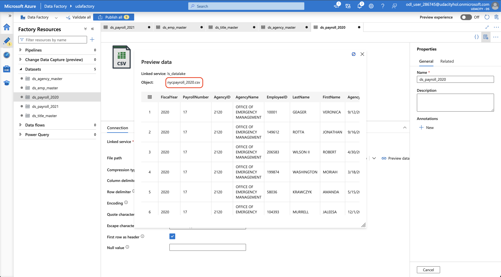

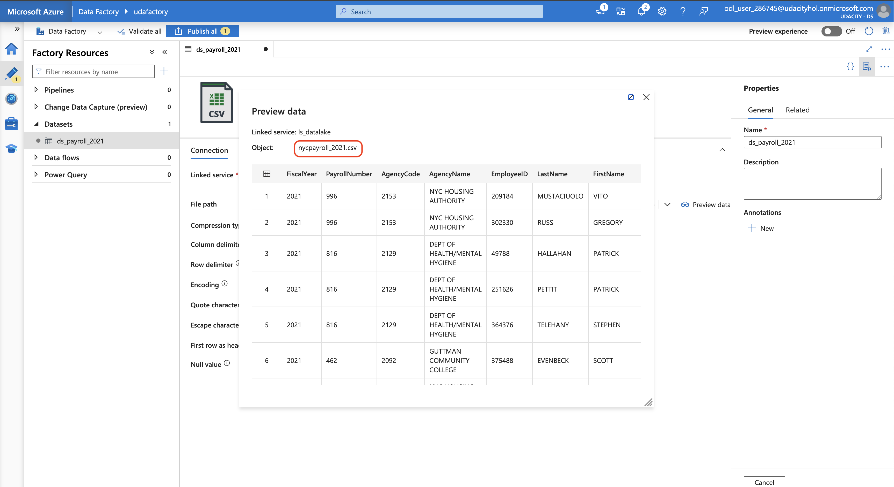

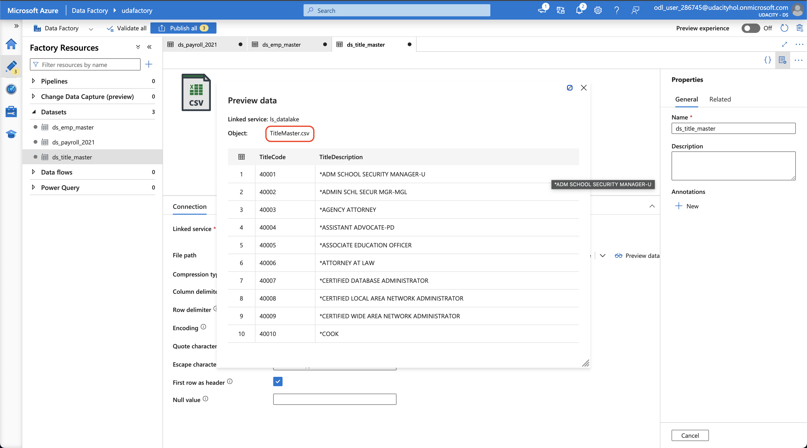

Created Datasets for SQL DB:

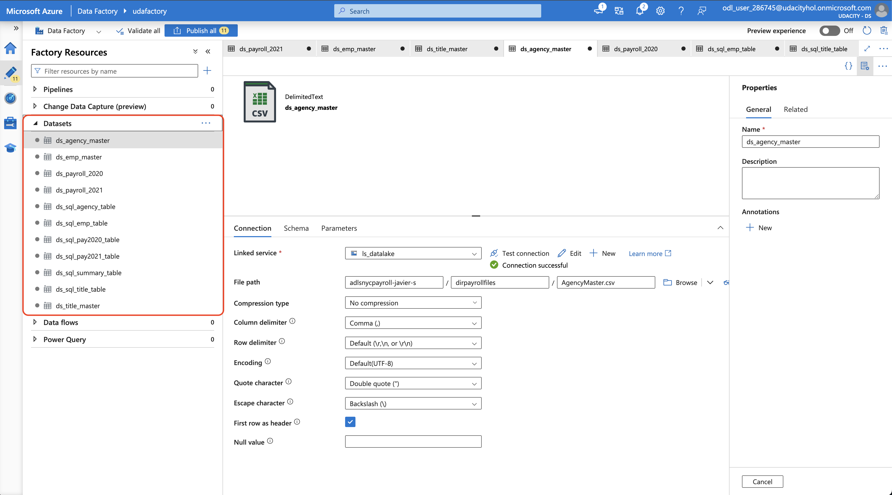

### Step 4: Create Data Flows

Dataflows in Data Factory:

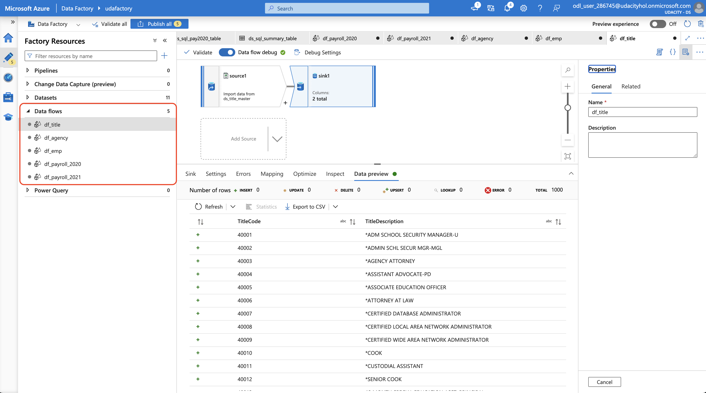

### Step 5: Data Aggregation and Parameterization

Aggregate dataflow in Data Factory:

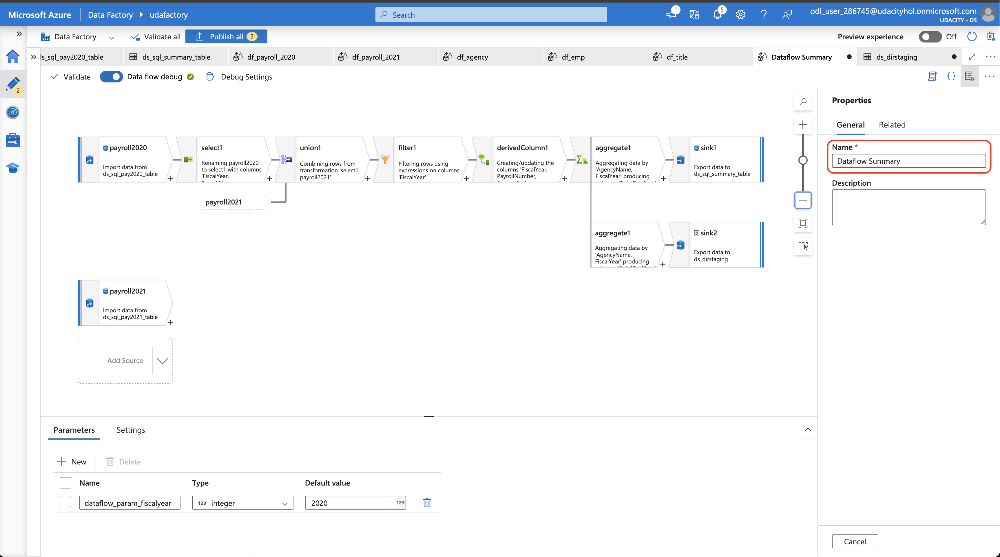

### Step 6: Pipeline Creation

Pipeline resource from Datafactory:

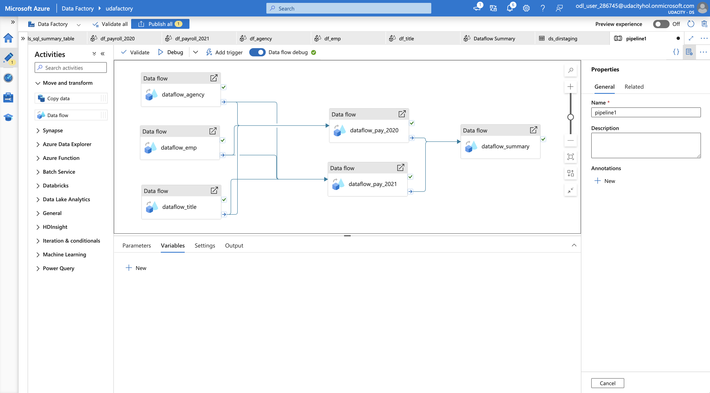

### Step 7: Trigger and Monitor Pipeline

Successful pipeline run:

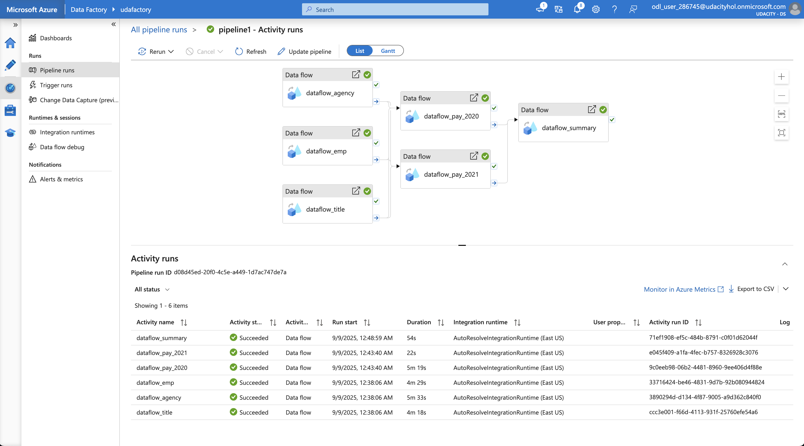

### Step 8: Verify Pipeline run artifacts

Query from SQL DB summary table:

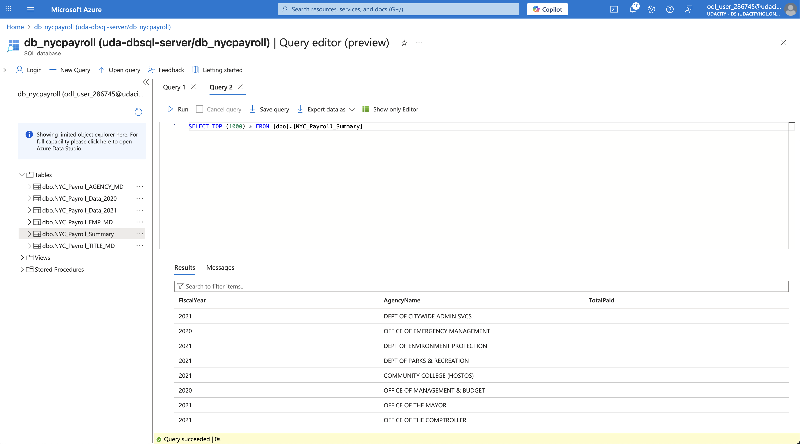

dirstaging directory listing in Datalake that shows files saved after pipeline runs:

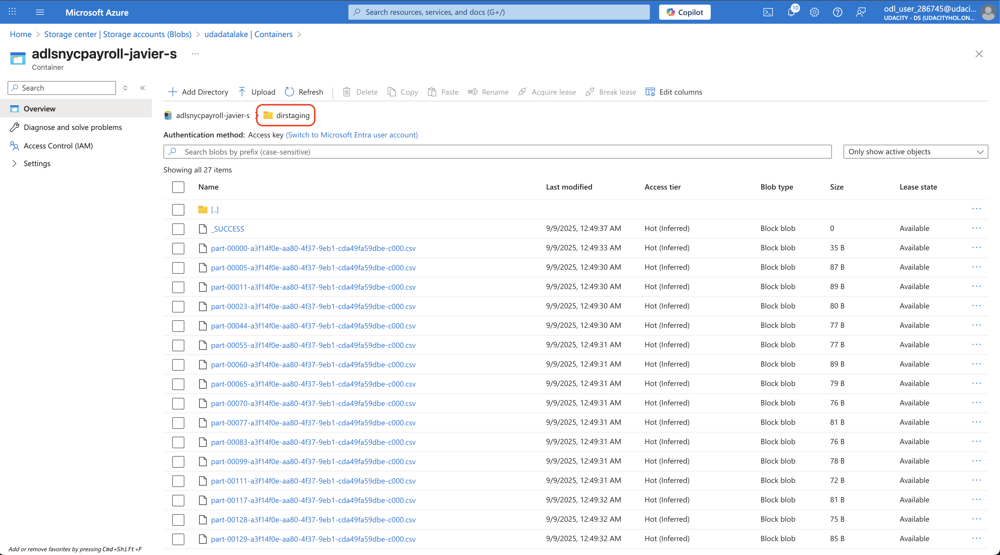

Query from Synapse summary external table:

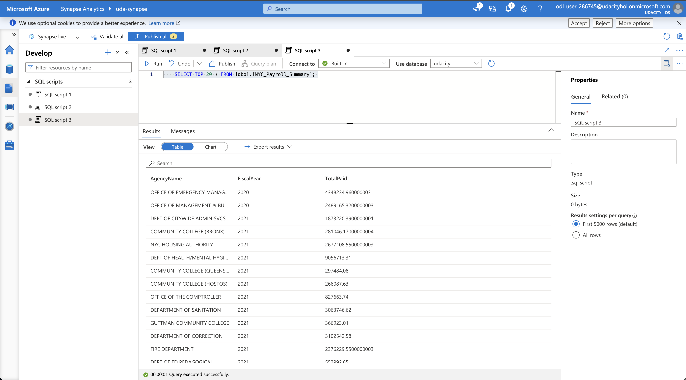

### Step 9: Connect your Project to Github

Published objects from Azure Data Factory:

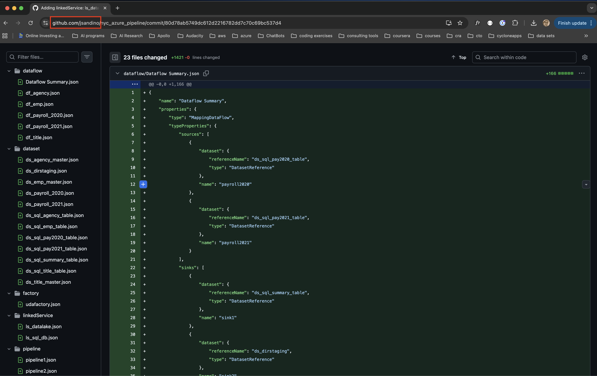